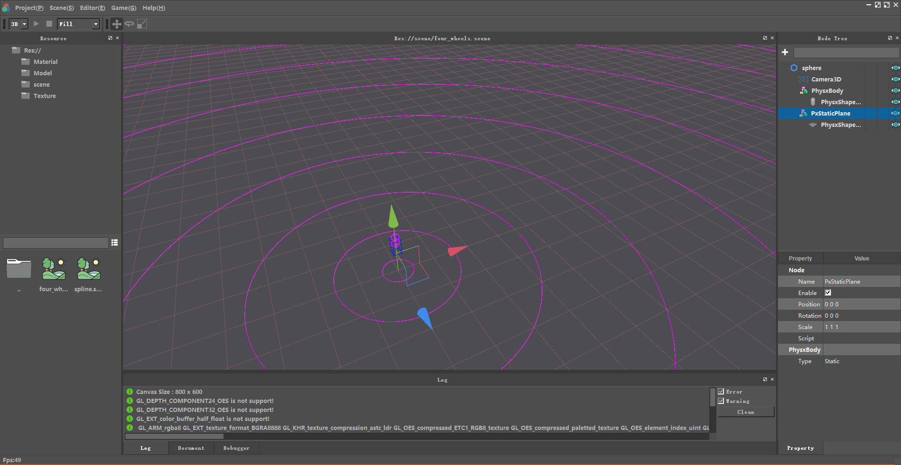

# Physx 可视化调试
PhysX 是一款由 [Nvidia](https://developer.nvidia.com/gameworks-physx-overview) 开发的实时开源物理引擎，著名的游戏引擎如 Unity3D、Unreal Engine (Version 3 and 4) 都整合了Phsyx 用于底层物理模拟。

## 1. 源码下载
Physx 当前最新版本是 4.1, 可以直接在Github上Clone下载   
[NVIDIAGameWorks/Physx](https://github.com/NVIDIAGameWorks/PhysX)

## 2.调试
当我们完成了PhysX的编译、链接、初始化、刚体创建、场景模拟等等步骤后，要如何观察当前物理场景的模拟结果呢?   
目前常见的方式有三种
1. [Physx Visual Debugger](https://developer.nvidia.com/physx-visual-debugger) 通过外部工具可视化物理场景。
2. [Debug Visualization](https://docs.nvidia.com/gameworks/content/gameworkslibrary/physx/guide/Manual/DebugVisualization.html) 在引擎中直接渲染物理场景。
3. 引擎根据物理设置自己实现物理世界可视化功能。

### 2.1 PhysX Visual Debugger
Physx Visual Debugger (PVD) 是官方提供的一款简单易用的Physx可视化工具，
通过使用 Physx Visual Debugger (PVD), 我们可以观察、调试、交互应用程序的物理场景。   
[下载](https://developer.nvidia.com/physx-visual-debugger)   


#### 2.1.1 编译选项
Physx在编译时必须开启 PX_SUPPORT_PVD 宏，才能支持 PVD 的调试。在游戏发布时可以关闭该宏。   
[NpScene.cpp, Line[1849-1942]](https://github.com/NVIDIAGameWorks/PhysX/blob/93c6dd21b545605185f2febc8eeacebe49a99479/physx/source/physx/src/NpScene.cpp)
```cpp
void NpScene::simulateOrCollide(PxReal elapsedTime, physx::PxBaseTask* completionTask...)
{
    ...
	
#if PX_SUPPORT_PVD		
		//signal the frame is starting.	
		mScene.getScenePvdClient().frameStart(elapsedTime);
#endif

    ...

#if PX_SUPPORT_PVD
		mScene.getScenePvdClient().updateJoints();			
#endif

    ...
}
```

#### 2.1.2 PVD 初始化
physx::PxPvd 需要在 physx::PxFoundation 之后创建，然后在创建 physx::PxPhysics 时做为参数传入   
[bool PhysxModule::initPhysx()](https://github.com/NVIDIAGameWorks/PhysX/blob/93c6dd21b545605185f2febc8eeacebe49a99479/physx/source/physx/src/NpScene.cpp)
```cpp
	bool PhysxModule::initPhysx()
	{
        ...

		m_pxFoundation = PxCreateFoundation(PX_PHYSICS_VERSION, *m_pxAllocatorCb, *m_pxErrorCb);
		m_pxPvd = PxCreatePvd(*m_pxFoundation);
		m_pxPhysics = PxCreatePhysics(PX_PHYSICS_VERSION, *m_pxFoundation, physx::PxTolerancesScale(), isRecordMemoryAllocations, m_pxPvd);

        ...

		return m_pxPhysics ? true : false;
	}
```
#### 2.1.3 PVD 连接
**开始连接前必须先启动 PhysX Visual Debugger 程序**   
Pvd 的传输即可以通过 physx::PvdDefaultSocketTransport 网络实时传输, 连接后可以在Physx Visual Debugger 中实时看到模拟结果。
```cpp
	void PvdCommand::pvdConnect()
	{
		physx::PxPvd* pvd = PhysxModule::instance()->getPxPvd();
		if (pvd)
		{
			physx::PxPvdTransport* transport = physx::PxDefaultPvdSocketTransportCreate("localhost", 5425, 10);
			pvd->connect(*transport, physx::PxPvdInstrumentationFlag::eALL);
		}
	}
```
也可以通过 physx::PvdDefaultFileTransport 先传输保存到文件，最后再通过 Physx Visual Debugger 打开查看模拟结果。   
[PxPvdDefaultFileTransport.h](https://github.com/NVIDIAGameWorks/PhysX/blob/93c6dd21b545605185f2febc8eeacebe49a99479/physx/source/pvd/src/PxPvdDefaultFileTransport.h)


#### 2.1.4 物理场景更新
因为 pvd 传输的相关代码是在 Physx 的 tick 函数中被调用的，所以引擎还必须每帧调用 physx::PxScene 的 simulate 函数。这也是为什么我们在UE4编辑器模式下 Pvd connect 后，看不到模拟结果的可能原因(未查证)。
```cpp
void PhysxModule::update(float elapsedTime)
	{
		if (m_pxScene)
		{
			// step
			m_accumulator += elapsedTime;
			while (m_accumulator > m_stepLength)
			{
				m_pxScene->simulate(m_stepLength);
				m_pxScene->fetchResults(true);

				m_accumulator -= m_stepLength;
			}
		}
	}
```

#### 2.1.5 查看模拟结果
至此，我们应该就可以在 Physx Visual Debugger 中查看到 physx 的模拟结果了。   
此种通过外部工具查看物理模拟结果的方式，只需要引擎提供少量的代码更改就可以实现。并且结果一定和物理引擎的真实运行数据相匹配(不匹配也是Nvidia Physx 的代码BUG)。   
缺点是渲染数据不方便与物理数据做对比，需要使用者进行脑补匹配。

### 2.2 [Debug Visualization](https://docs.nvidia.com/gameworks/content/gameworkslibrary/physx/guide/Manual/DebugVisualization.html)

除了通过 Physx Visual Debugger 查看物理模拟结果外，我们也可以通过 Physx 的相关API接口， 抽取可视化调试信息，然后在引擎的渲染窗口直接绘制物理数据。   
物理调试信息是由 基本渲染几何体组成的，比如 点、线、三角形。


#### 2.2.1 开启 Debug Visualization
可以通过物理场景的 setVisualizationParameter 设置需要渲染的物理数据类型。   
数据类型可以参考 [PxVisualizationParameter](https://github.com/NVIDIAGameWorks/PhysX/blob/93c6dd21b545605185f2febc8eeacebe49a99479/physx/include/PxVisualizationParameter.h) 的定义   
```cpp
m_pxScene->setVisualizationParameter(physx::PxVisualizationParameter::eSCALE, isEnable ? 1.f : 0.f);
m_pxScene->setVisualizationParameter(physx::PxVisualizationParameter::eCOLLISION_SHAPES, isEnable ? 1.f : 0.f);
m_pxScene->setVisualizationParameter(physx::PxVisualizationParameter::eCOLLISION_STATIC, isEnable ? 1.f : 0.f);
m_pxScene->setVisualizationParameter(physx::PxVisualizationParameter::eCOLLISION_DYNAMIC, isEnable ? 1.f : 0.f);
```

#### 2.2.2 获取渲染调试数据 physx::PxRenderBuffer
在物理场景更新后，可以通过 physx::PxScene 的 getRenderBuffer 获取渲染数据。
```cpp
const physx::PxRenderBuffer& rb = m_pxScene->getRenderBuffer();
m_debugDraw->update(elapsedTime, rb);
```

#### 2.2.3 调用引擎的渲染接口，执行渲染  
[physx_debug_draw.cpp](https://github.com/timi-liuliang/echo/blob/18a9893a3e0d2b0203e8449d78c6f619312f3286/engine/modules/physx/physx_debug_draw.cpp)
```cpp
	void PhysxDebugDraw::update(float elapsedTime, const physx::PxRenderBuffer& rb)
	{
		m_gizmosNode->update(elapsedTime, false);

		drawLines(rb);
		drawTriangles(rb);
	}

	void PhysxDebugDraw::drawLines(const physx::PxRenderBuffer& rb)
	{
		Vector3 shift = PhysxModule::instance()->getShift();
		for (physx::PxU32 i = 0; i < rb.getNbLines(); i++)
		{
			const physx::PxDebugLine& line = rb.getLines()[i];
			Vector3 pos0(line.pos0.x, line.pos0.y, line.pos0.z);
			Vector3 pos1(line.pos1.x, line.pos1.y, line.pos1.z);
			Color   color(line.color0);
			m_gizmosNode->drawLine(pos0 - shift, pos1 - shift, color);
		}
	}

	void PhysxDebugDraw::drawTriangles(const physx::PxRenderBuffer& rb)
	{
		Vector3 shift = PhysxModule::instance()->getShift();
		for (physx::PxU32 i = 0; i < rb.getNbTriangles(); i++)
		{
			const physx::PxDebugTriangle& tri = rb.getTriangles()[i];
			Vector3 pos0(tri.pos0.x, tri.pos0.y, tri.pos0.z);
			Vector3 pos1(tri.pos1.x, tri.pos1.y, tri.pos1.z);
			Vector3 pos2(tri.pos2.x, tri.pos2.y, tri.pos2.z);
			Color   color(tri.color0);
			m_gizmosNode->drawTriangle( pos0 - shift, pos1 - shift, pos2 - shift, color);
		}
	}
```
#### 2.2.4 在引擎渲染窗口中直接查看物理数据

此种通过外部工具查看物理模拟结果的方式，也只需要引擎提供少量的代码更改就可以实现。并且结果一定和物理引擎的真实运行数据相匹配(不匹配也是Nvidia Physx 的代码BUG)。   
缺点是对于 Heightfield 及 Mesh 类型，因为没有缓存机制，每一帧都在更新所有的渲染数据，效率极其低下(暂不排除个人实现有问题)。   
[issue.visualizeHeightField very very slow... #432](https://github.com/NVIDIAGameWorks/PhysX/issues/432)

### 3.1 引擎根据物理设置自己实现物理世界可视化功能。
比如UE4查看物理数据就是通过组件是否配置了物理的相关的属性，引擎自身实现的渲染功能。    
所以在使用UE4查看物理数据时，对于一些团队自定义的组件，经常出现物理数据显示不正确的情况。需要由引擎团队成员负责管理维护。好处当然是想怎么渲染就怎么渲染，自由性比较大。工作量也大，提供更多就业机会。


## 参考
[1]. [NVidia](https://github.com/NVIDIAGameWorks/PhysX). [NVIDIA PhysX SDK 4.1](https://houdinitricks.com/creating-attributes-with-python-in-houdini/) (2021)   
[2]. [NVidia](https://github.com/NVIDIAGameWorks/PhysX). [Debug Visualization](https://docs.nvidia.com/gameworks/content/gameworkslibrary/physx/guide/Manual/DebugVisualization.html) (Unknown)